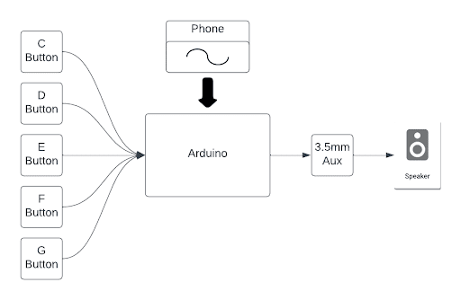
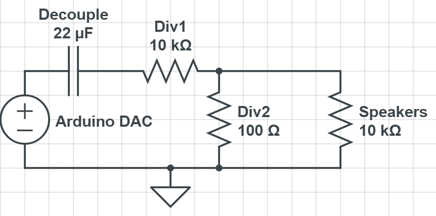

# ArduinoSynth
This repository was made to keep track of the code and related files for a physically built digital synthesizer circuit making use of an Arduino Uno R4 WiFi. The code and files for a software app that allows users of the synthesizer to customize the physical synth's waveform via bluetooth are also hosted in this repository. The image below shows the general overview of the project.

  

## Hardware Overview
- The synth uses push button inputs wired to the Arduino Uno's digital input pins, and utilizes the Arduino board's built in pull-up resistors. These buttons allow individual notes to be played (see the [Software Overview](#software-overview) section of this file for information on the software implementation of these inputs).
- A 3.5mm Aux port was added to the physical synth design to facilitate audio output. Both left and right audio outputs were tied to the same souce for this project, as the DAC only produced a mono output. A lowpass filter was also implemented in order to decouple the DC offset from the Arduino's DAC in order to isolate the AC waveform desired for playback. A simple filter was designed with a capacitor and a voltage dividing series of resistors. It's possible that a more advanced filter design could improve sound quality, but designing and implementing such a filter was not feasable for the timeline of this project. The filter with its final design values is show below. The speakers used had a built in amplifier, which is the reason for the massive voltage divider ratio of 100:1.

  

- The ESP32 chip on the Arduino Uno R4 WiFi has built in Bluetooth Low Energy. This technology was used to facilitate comunication between the software app portion of this project and the Arduino board.

## Software Overview
- The push buttons connected to the Arduino Uno were continuously polled in a loop, taking inspiration from a similar Arduino based [digital synthesizer](https://www.allaboutcircuits.com/projects/creating-a-digitally-controlled-oscillator-based-audio-synthesizer-with-arduino-nano/) designed by Darby Hewitt. This project observed the same effect wherein this continuous polling did not affect the performance of the device in a noticable way.
- Analog audio output waves were generated from the Arduino's DAC by referencing the design described in chapter 5 of J. Valvano and R. Yerraballi's Introduction to Embedded Systems Volume 8. This method involves storing an array of discrete samples that represent an analog waveform. By outputing these samples sequentially on interupts, an AC waveform can be played. The frequency of the interupts can be used to define the frequency of the waveform, and therefore the frequency of the note played. The following equation relates the inturupt frequency to the note frequency:

$$\text{Note Frequency}=\frac{\text{Interupt Frequency}}{\text{Number of Discrete Samples}}$$

## Sound Demo
